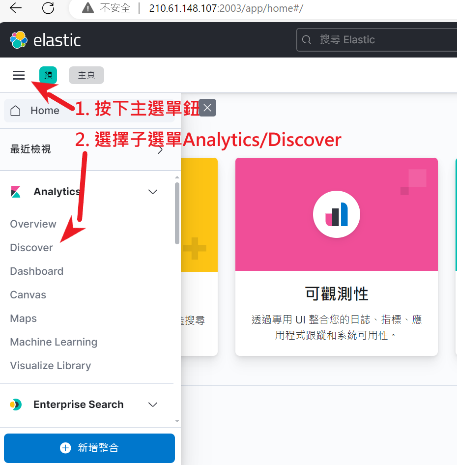
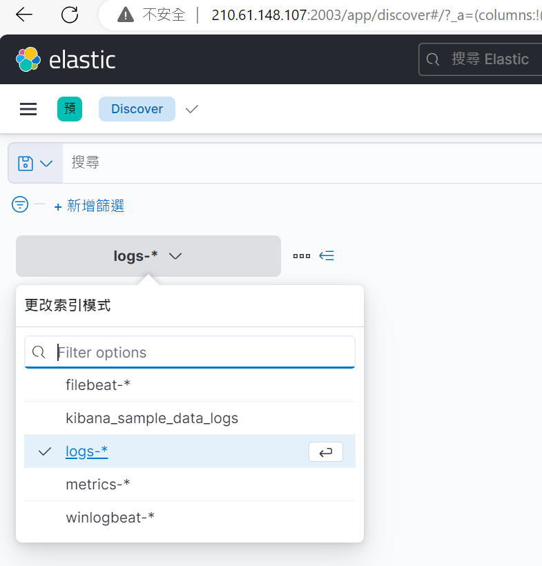
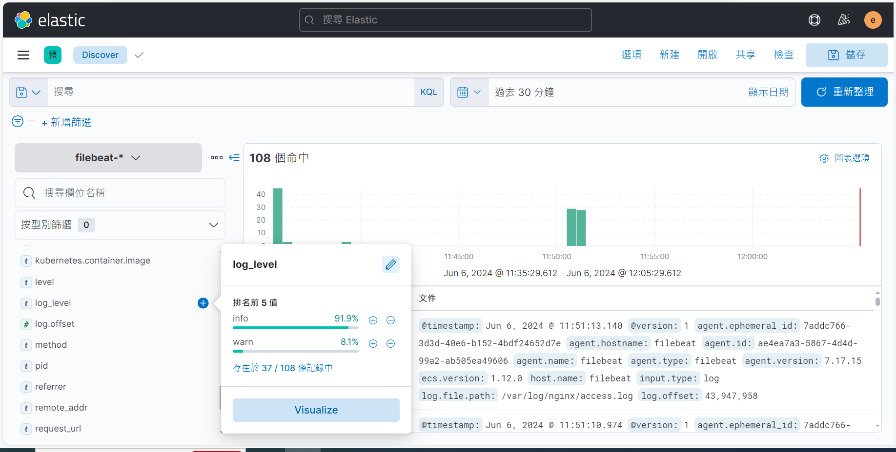
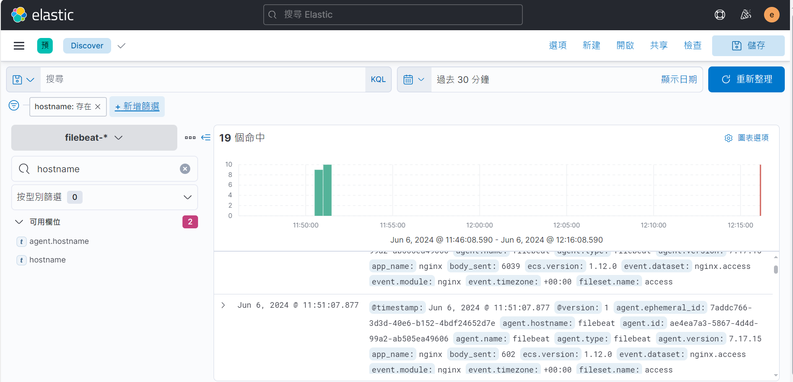
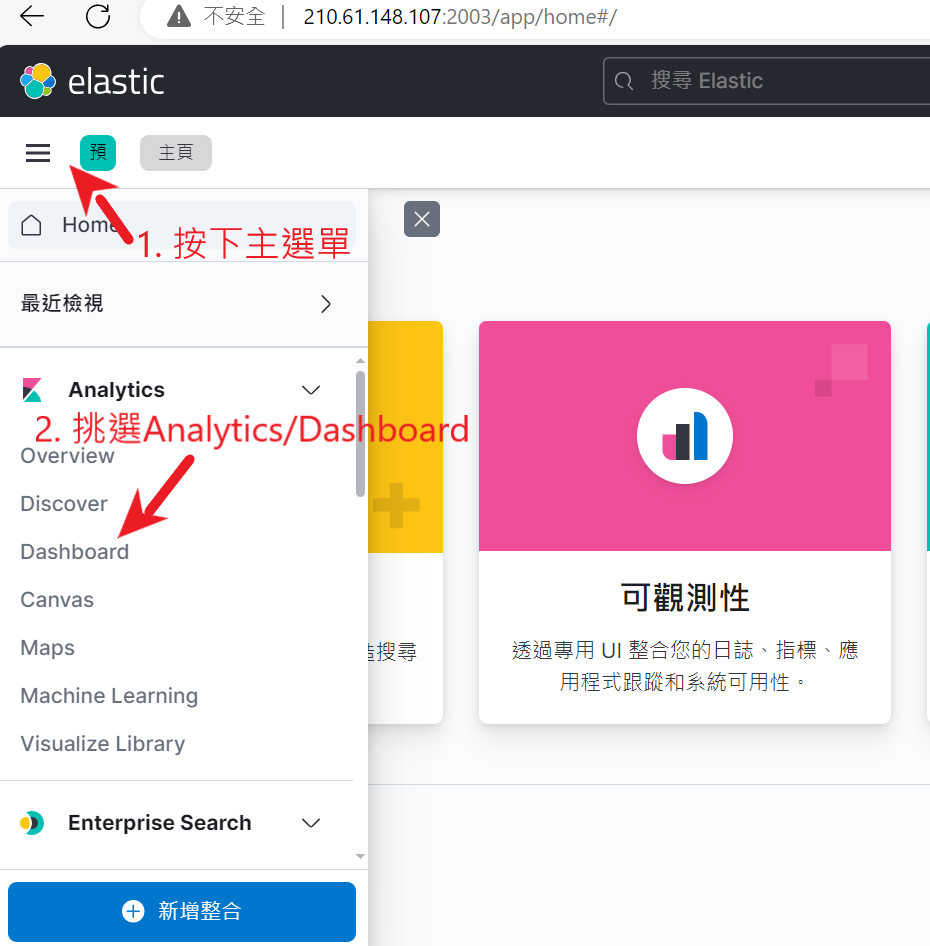

# Select Data Index Template

1. 從左上角主選單中選擇 Analytics/Discover





2. 選擇資料來源模版, 目前範例寫入的索引為```filebeats-7.17.15-nginx-access-error-test1```, 可用的模版為```filebeat-*```



3. 挑選過濾欄位, ```hostname, app_name, container_id , log_level , message , request_url, parameters``` 等7項為此次測試用加入欄位,這裡以```hostname```為測試用過濾欄位


4. 過濾後的事件集合



5. 檢視單一事件內容


6. 事件內容JSON輸出格式


# 建立儀表版

1. 從左上角主選單中選擇 ```Analytics/Dashboard```



2. 切換到第3頁, 可以看到系統內建的```\[Filebeat Nginx\] Access and error logs ECS```, 此為Filebeat提供的Nginx模組LOG儀表版


2.1 內建Nginx儀表版內容


3. 建立儀表版


4. 建立視覺化


5. 選擇欄位, 這裡一樣以```hostname```為範例
6. 將左方的```hostname```欄位, 拖放到中間的panel, 然後使用右方下拉選單或下方建議的Thumbnail調整圖表類型, 必要時可以加入多個欄位


7. 處理欄位後, 按下右下方```儲存到庫```鈕, 輸入Len名稱


8. 按下儲存儀表版, 輸入名稱```IISI 測試用 Nginx 儀表版```


9. 重新從左上角主選單中選擇 ```Analytics/Dashboard```, 可以看到新產生的```IISI 測試用 Nginx 儀表版```


